# footprint

**Evidence-driven vendor AI-usage analysis for third-party risk management, built only on a vendor's public footprint.**

> [!CAUTION]
> **Confidential case-study material.** This private repository holds team work for a consulting case study
> about **real organisations**. Do not make it public. Do not publish or upload the deck, the workbook or any
> finding (no gists, Pages, Drive, slide-sharing or paste sites). Never contact the vendors.
> `.githooks/pre-push` refuses to push unless the repository is private.

Vendors increasingly ship AI inside the services they sell, often without saying so. A TPRM team needs a
**repeatable** way to answer three questions for each vendor:

1. **How critical is this vendor to us?** The answer sets how hard we look.
2. **Does the vendor *genuinely* use AI in the service it provides us**, or is "AI" only in its marketing?
3. **If it does, what is our AI security risk?** That means data exposed to AI models, undisclosed AI
   sub-processors, and opaque decisions that affect us.

`footprint` reads the vendor inventory workbook and works through these steps:

- rates each vendor's **criticality** with a deterministic rubric;
- plans the **assessment depth** that tier warrants;
- collects **public OSINT evidence** (filings, legal and product pages, job postings, DNS, archives and
  provider stories) under explicit legal and ethical controls;
- **tags every signal** with transparent evidentiary-strength labels;
- concludes whether AI is used, then scores the **AI security risk** and recommends actions.

The results go back into the workbook's analyst columns, with a full evidence log. **Every conclusion traces to
a captured, hashed, verbatim source excerpt**, and a run can be replayed offline to reproduce the same answers.

---

## Contents

- [How it works](#how-it-works)
- [Method](#method)
- [Guardrails](#guardrails-confidentiality-ethics-and-anti-hallucination)
- [Quick start](#quick-start)
- [Usage](#usage)
- [Outputs](#outputs)
- [Repository layout](#repository-layout)
- [Testing](#testing)
- [Project status](#project-status)
- [Team](#team)

---

## How it works

```mermaid
flowchart LR
    A[Vendor inventory .xlsx] --> B[Intake & template validation]
    B --> C[Criticality rubric<br/>profile fields only]
    C -->|HC1 analyst confirms tier| D[Depth planner<br/>sources, caps, stop rules]
    D --> E[Discovery & compliant capture<br/>ToS register → robots.txt → rate limit]
    E --> F[Evidence store<br/>raw bytes + SHA-256 + UTC]
    F --> G[Extraction<br/>dated text, sentences, AI passages]
    G --> H[Signal analysis<br/>rules ∥ Gemini claim extraction]
    H --> I[Verification V1–V9<br/>exact-quote check, entity guard]
    I -->|HC2 analyst review| J[AI-usage verdict<br/>Yes / No / Inconclusive]
    J --> K[AI security risk<br/>score, gates, caps, actions]
    K --> L[Workbook columns L–V<br/>+ Evidence & Coverage logs]
```



The rule is **AI proposes, code verifies, analyst approves**:
- Gemini helps find and label evidence.
- Deterministic code checks every quote against the captured source and assigns the final tags.
- An analyst accepts or rejects each item before it is cited.
- The LLM never supplies URLs, final labels or deliverable prose.

| Component | Module(s) | What it does |
|---|---|---|
| Intake and workbook I/O | `workbook.py` | Validates the template. Writes only the analyst (cream) cells and never edits provided cells. Has a fidelity diff. |
| Criticality | `criticality.py`, `config/rubric.toml` | Five-factor weighted rubric with floor rules, sensitivity analysis and a plain-language rationale. |
| Depth | `depth.py`, `config/depth.toml` | Turns the tier into mandatory source families, request caps, budgets and stopping rules. |
| Network policy | `net/` | Terms-of-use register, Protego robots.txt, per-host rate limits, honest User-Agent, live and replay fetchers. |
| Collectors | `collectors/` | DNS (DoH), vendor site + sitemaps, WordPress REST, SEC EDGAR, job boards (Workday, Oracle, Workable), Wayback (read-only), curated seeds, manual captures. |
| Evidence store | `capture/` | Content-addressed blobs, a text store, manual-capture import and excerpt-anchored screenshots. |
| Extraction | `extract.py`, `config/lexicon.toml` | Main text, publication dates and their basis, sentences with offsets, AI-lexicon passages with suppressors. |
| Signal analysis | `rules.py`, `ai.py`, `verify.py`, `cluster.py` | Evidence tags, Gemini claim extraction behind a payload guard, quote verification, independence clusters. |
| Decisions | `verdict.py`, `risk.py`, `actions.py` | Verdict rules, AI risk matrix, action playbook (questionnaire items, contract clauses, monitoring). |
| Outputs | `compose.py`, `sheets.py`, `pipeline.py`, `cli.py` | Cell templates, Evidence/Coverage/Method sheets, orchestration, CLI. |
| Interfaces | `app/`, `notebooks/`, `deck/` | Streamlit app, Colab/Jupyter notebook and the walkthrough deck builder. |

## Method

### 1. Criticality: profile first, deterministic

Criticality uses **only the provided vendor profile** and is decided **before** any OSINT, so evidence can never
move the tier. Five factors are each scored 0–4:

| Factor | Weight | Reads from |
|---|---|---|
| **O** Operational dependency | ×7 | dependency rating |
| **D** Data sensitivity (D3-P = privileged production access or credentials) | ×6 | data accessed |
| **P** Payment-flow involvement | ×5 | service + business process |
| **R** Regulatory exposure | ×4 | service + data |
| **V** Customer-data volume | ×3 | data accessed + annual volume |

`Score = 7O + 6D + 5P + 4R + 3V` (0–100): **Critical ≥ 80, High 50–79, Medium 25–49, Low ≤ 24.**

Floor rules stop one severe factor from being averaged away:
- **F1:** total dependency gives Critical.
- **F2:** in the payment path with high dependency gives Critical.
- **F3:** highly restricted data at scale gives at least High.
- **F4:** privileged production access gives at least High.
- **F5:** customer non-public personal information (NPI) gives at least Medium.
- **F6:** sensitive data at population scale plus high dependency gives Critical.

Every factor records its anchor and the **verbatim trigger phrase** from the profile. The tool also reports a
one-step sensitivity check and a ±1 weight-perturbation check, so another analyst reaches the same tier. The
rubric is calibrated on the template's worked example.

### 2. Depth follows the tier, not the vendor's publicity

| Tier | Depth | Mandatory source families |
|---|---|---|
| Critical | Full review | legal & trust · SEC filings · product docs · own job postings · DNS · independent corroboration · archive history |
| High | Standard review | legal & trust · product docs · job postings · DNS · independent corroboration · filings if registered |
| Medium | Focused review | privacy/sub-processors, keyword scans, one filing query, DNS |
| Low | Screen | homepage, privacy notice, sub-processor/trust page, DNS |

Each family ends with a recorded status (done, done manually, not applicable, stopped by rule, blocked by
robots / terms / bot wall). These statuses form the **Coverage Log**, which is the negative evidence behind any
"not detected" conclusion. Questionnaires, contract review and attestations are **reserved for the client**:
the team never contacts vendors.

### 3. Evidentiary weight: transparent tags

Every signal carries a tag string such as `U3 · SR:B · SP:S2 · RL:R2 · RC:T3 · IC:2 · locus=delivery_ops`:

| Tag | Meaning |
|---|---|
| **U** | Signal class: AI in the exact service, platform, operations, named provider, capability, governance, marketing, limiting statement |
| **SR** | Source reliability, Admiralty A–F. Filings and legal notices rate highest; marketing rates low. |
| **SP** | Specificity S0–S3, from genuine-use indicators (named model, data-flow description, GA release note, developer artifact…) versus marketing indicators (buzzwords, aspirational language, automation relabelled as AI) |
| **RL** | Relevance to the exact contracted service, R0–R3 |
| **RC** | Recency, T0–T3 |
| **IC** | Corroboration, Admiralty 1–6 |

Four ordered tests separate **genuine use from marketing**: the definition test (scheduling, RPA, rules
engines and templating are *not* AI), the subject test, the use-state test (deployed vs. "exploring"), and the
specificity test. The verdict rules then conclude **Confirmed / Probable** (column O = Yes), **Not detected /
Affirmed negative** (No) or **Inconclusive**, worded in ICD 203 likelihood and confidence language.

### 4. AI security risk

`ARP = 2E + 2K + TP + TG` (0–18):

| Input | Meaning |
|---|---|
| **E** | Client data exposed to AI |
| **K** | Decision impact |
| **TP** | Tier points |
| **TG** | Transparency gaps: AI use, providers, data-use terms, human oversight, governance, incident notification |

The adjustments run in a fixed order: base class → materiality gate → escalator floors (e.g. undisclosed AI
sub-processor, training on client data, agentic actions on production) → verdict cap. Inconclusive cases are
labelled **Provisional**, with an "if confirmed" ceiling and the condition that would flip the class. Actions come
from a playbook: a questionnaire, AI contract clauses, sub-processor inventory, monitoring cadence and escalation.

Full method, thresholds and calibration: [`docs/design.md`](docs/design.md).

## Guardrails: confidentiality, ethics and anti-hallucination

- **Passive OSINT only.** GET requests, no logins, forms or accounts, and no vendor contact.
- **Terms of use before robots.txt.** Every host matches an entry in [`config/tou.toml`](config/tou.toml); each
  entry quotes the governing clause and was verified by reading the site's terms. Sites whose terms bar
  automated access are **manual capture only** (see
  [`docs/manual_capture_checklist.md`](docs/manual_capture_checklist.md)).
- **No evasion.** An honest User-Agent (`footprint-osint/1.0`). No TLS impersonation or stealth browsers. A site
  that refuses us is recorded as `blocked_bot` and is not retried.
- **Never** Wayback "Save Page Now" (it would leave a public trace). Archive lookups are read-only.
- **Public text only to the LLM.** The Gemini free tier may use prompts for training, so a closed payload type and
  a payload guard block client names, profile text, tiers and findings. They also redact emails and phone
  numbers, and skip hosts that disallow AI processing. Every call and every withheld passage is logged without
  its text.
- **Quotes are verified.** A model-proposed quote counts only if it is an exact slice of the captured source
  (checks V1–V9). Excerpts in the workbook are verbatim, never paraphrased.
- **Traceability.** Raw bytes + SHA-256 + retrieval time (UTC) + robots/terms decision for every capture, with an
  excerpt-anchored screenshot for primary evidence. A run manifest pins config and prompt hashes.

## Quick start

Requirements: Python ≥ 3.11 (developed on 3.14; the notebook targets Colab's 3.12) and
[uv](https://docs.astral.sh/uv/).

```bash
uv sync --all-extras                     # core + live collection + AI + app + deck extras
cp .env.example .env                     # then fill in the values below (never commit .env)
uv run pytest -q                         # offline test suite
uv run footprint --help
```

`.env` keys:

| Key | Purpose |
|---|---|
| `GEMINI_API_KEY` | Optional. Enables Gemini claim extraction. Without it, the rules-only path runs. |
| `FOOTPRINT_SEC_CONTACT` | Contact email the SEC fair-access policy requires in the User-Agent for EDGAR requests |
| `FOOTPRINT_TEAM_NAME` | Shown in the "Assessed By / Date" column and on the deck |
| `PYTHONUTF8=1` | Windows only: keeps excerpts, dashes and arrows intact on the console |

Live collection needs Chromium for screenshots: `uv run playwright install chromium`.

## Usage

### Criticality and depth (profile only, instant)

```bash
uv run footprint criticality data/input/Meridian_Vendor_Input.xlsx
uv run footprint criticality data/input/Meridian_Vendor_Input.xlsx --out submission/draft.xlsx --team "Team Osprey"
uv run footprint override-tier V-003 Critical --reason "BIA shows no manual workaround" --analyst RK   # HC1
```

### Collect public evidence

```bash
uv run footprint collect --all --mode live_rules      # polite live collection per depth plan
uv run footprint collect --vendor V-005 --mode replay # offline replay from the evidence store
uv run footprint coverage <RUN_ID>                    # Coverage Log + gate decisions of a run
uv run footprint capture import --analyst RK          # import manual captures from evidence/manual_inbox/
```

### Demo interfaces

```bash
uv run streamlit run app/streamlit_app.py             # upload → criticality → evidence → risk → export
uv run jupyter notebook notebooks/footprint_demo.ipynb
uv run python deck/build_deck.py --out submission/Team_Osprey_Vendor_AI_Footprint.pptx
```

On Colab, upload the private `footprint_bundle.zip` (built by `footprint.bundle.build_bundle`; never committed)
and run the notebook top to bottom. It installs the package, loads the frozen evidence pack and replays the
assessment.

## Outputs

The completed workbook keeps every provided cell and the worked example untouched. It fills the analyst columns
**L–V** for each vendor:

| Column | Content |
|---|---|
| L–N | Criticality tier, rationale and depth applied |
| O | AI usage detected (Yes / No / Inconclusive) |
| P | Verbatim evidence excerpts with source, date, URL and Evidence Log ID |
| Q | How the vendor may be using AI |
| R | AI sub-processors / model providers the vendor names |
| S–T | AI security risk class and its rationale |
| U | Recommended actions |
| V | Assessed by / date |

It also appends these sheets:
- **Evidence Log**: every item considered, with tags, hashes, screenshot reference and review status.
- **Coverage Log**: what was searched and with what result.
- **Criticality Workings**: factor levels, triggers, points, floors and sensitivity.
- **Method & Legend**: rubric, depth ladder, tag legend and exclusions.
- **Run Info**.

## Repository layout

```
config/        rubric, depth, sources, lexicon, risk, actions, terms-of-use register (versioned TOML)
seeds/         per-vendor curated seed URLs, aliases, service terms, ATS ids, collisions
prompts/       frozen, hashed Gemini prompt templates
src/footprint/ the engine (see "How it works")
app/           Streamlit demo app
notebooks/     Colab / Jupyter walkthrough
deck/          python-pptx deck builder (native, editable diagrams)
data/input/    the provided vendor workbook (SHA-256 pinned)
evidence/      captured sources: blobs, extracted text, screenshots, LLM cache (committed at the evidence freeze)
runs/          per-run manifests, captures, passages, coverage, fetch logs (committed at the evidence freeze)
review/        append-only analyst decisions (tier overrides, evidence reviews)
submission/    generated workbook and deck drafts
docs/          design, contracts, reports, manual capture checklist
tests/         unit, integration and gold-set tests
```

## Testing

```bash
uv run pytest -q                 # all offline tests (network tests are deselected by default)
uv run pytest -q -m network      # optional live smoke tests
```

The suite covers the following:
- **Rubric:** pins for every vendor and the worked example, plus brute-forced sensitivity.
- **Policy gates:** robots.txt edge cases, terms register, rate limits, bot-wall handling.
- **Evidence integrity:** hashes, exact offsets, charset decoding.
- **Lexicon traps:** "intelligent mail barcode", "in our DNA", "MCP" meaning Microsoft Certified Professional,
  and similar false positives.
- **Decision logic:** truth tables for verdict and risk rules.
- **Workbook fidelity:** provided cells untouched, formula injection blocked, column spans preserved.

[`tests/gold/gold_v1.json`](tests/gold/gold_v1.json) is a gold set from manual scouting. It measures collection
recall and tagging agreement.

## Project status

| Phase | Scope | Status |
|---|---|---|
| P0 | Repo, environment, design, terms register, Gemini smoke test | ✅ Done |
| P1 | Workbook I/O, criticality rubric, depth planner, overrides (columns L–N) | ✅ Done (`v0.1-core`) |
| P2 | Policy-gated collection, evidence store, extraction, Coverage Log | ✅ Done ([report](docs/p2_collection_report.md)) |
| P3 | Rules tagging, Gemini layer + payload guard, verification, verdicts | 🔄 Modules built and unit-tested; integration pending |
| P4 | Risk engine, actions, cell composer, screenshots, Streamlit app | 🔄 Modules built and unit-tested; integration pending |
| P5 | Analyst evidence review, notebook + Colab bundle, deck | ⏳ Planned |
| P6 | Evidence freeze, reproducibility check, final workbook + deck | ⏳ Planned |

Manual captures for terms-restricted sites are tracked in
[`docs/manual_capture_checklist.md`](docs/manual_capture_checklist.md).

## Team

Team Osprey. Built with [Claude Code](https://claude.com/claude-code) as a pair-programming agent; every
commit carries a co-author trailer.

Proprietary and confidential: not licensed for reuse or distribution.
