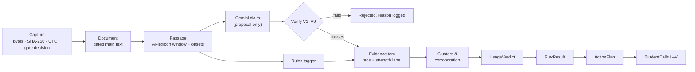

<div align="center">

# footprint

**Find out whether a vendor really uses AI in the service it sells you, and what that means for your risk,
using only the vendor's public footprint.**


[How it works](#how-it-works) · [Method](#method) · [Guardrails](#guardrails) · [Quick start](#quick-start) ·
[Usage](#usage) · [Outputs](#outputs) · [Status](#project-status) · [Limitations](#known-limitations) ·
[Docs](#documentation)

</div>

> [!CAUTION]
> **Confidential case-study material.** This private repository holds team work for a consulting case study
> about **real organisations**. Do not make it public. Do not publish or upload the deck, the workbook or any
> finding (no gists, Pages, Drive, slide-sharing or paste sites). Never contact the vendors.
> `.githooks/pre-push` refuses to push unless the repository is private.

---

## Why

Vendors increasingly build AI into the services they sell, often without saying so. A third-party risk
management (TPRM) team needs a **repeatable, defensible** way to answer three questions about each vendor:

1. **How critical is this vendor to us?** The answer decides how hard we look.
2. **Does the vendor *genuinely* use AI in the service it provides us**, or is "AI" only in its marketing?
3. **If it does, what is our AI security risk?** That covers data exposed to AI models, undisclosed AI
   sub-processors, and opaque decisions that affect us.

`footprint` answers them from the vendor inventory workbook and public sources alone. The tool never sends a
questionnaire and never logs in.

| You give it | It does | You get back |
|---|---|---|
| The vendor inventory workbook (`.xlsx`) | Rates criticality, plans review depth, collects public evidence politely, tags and verifies every signal, decides the AI-usage verdict, then scores AI risk and picks actions | The same workbook with the analyst columns **L–V** filled, plus Evidence Log, Coverage Log, Criticality Workings, Method & Legend, Evidence Images and Run Info sheets |

**Every conclusion traces back to a captured, hashed, verbatim source excerpt.** Replay mode re-derives the
same cells offline from the frozen evidence pack (see [Reproducibility](#reproducibility) for exactly what it
pins).

## Principles

| | Principle | What it means in practice |
|---|---|---|
| 1 | **Criticality first, from the profile only** | The tier comes from the provided profile columns, before any OSINT runs. Evidence can never move the tier. |
| 2 | **AI proposes, code verifies, the analyst decides** | Gemini helps find and label evidence. Deterministic code checks every quote and assigns the final tags. A rule-tagged item that passes verification is citable unless an analyst rejects it; a Gemini-only proposal is cited only after an analyst accepts it. The LLM never supplies URLs, final labels or the text of cells L–V. |
| 3 | **Capture before cite** | Nothing is cited until it has been captured (raw bytes, SHA-256, UTC time, URL), text-extracted and quote-verified. |
| 4 | **Replayable** | The frozen evidence pack, the LLM cache, the seeds and the review stores together reproduce identical L–V cells offline, so the demo never depends on the network or on quota. |
| 5 | **Practise what we assess** | Only public text goes to the LLM, through a payload guard. Every request passes a terms-of-use register and robots.txt. There is no contact with vendors. |

---

## How it works

```mermaid
flowchart LR
    A[Vendor inventory .xlsx] --> B[Intake &<br/>template validation]
    B --> C[Criticality rubric<br/>profile fields only]
    C -->|HC1 analyst confirms tier| D[Depth planner<br/>families, caps, stop rules]
    D --> E[Compliant capture<br/>ToS register → robots.txt → rate limit]
    E --> F[Evidence store<br/>raw bytes + SHA-256 + UTC]
    F --> G[Extraction<br/>dated text, sentences, AI passages]
    G --> H[Signal analysis<br/>rules ∥ Gemini claims]
    H --> I[Verification V1–V9<br/>exact quote, entity guard]
    I -->|HC2 analyst review| J[AI-usage verdict<br/>Yes / No / Inconclusive]
    J --> K[AI security risk<br/>score, gate, floors, cap]
    K --> L[Actions + cells L–V<br/>+ appended sheets]
```



`HC1` and `HC2` are the two human checkpoints:

- **HC1.** An analyst confirms or overrides the criticality tier, with a reason.
- **HC2.** An analyst reviews evidence items. Accepting a Gemini-only proposal makes it citable; rejecting any
  item removes it from the verdict, the risk score and the cells. Reviewing every cited item is a P5 exit step,
  so drafts made before then cite rule-verified items that nobody has reviewed yet (the Evidence Log shows each
  item's review status).

Both decisions go to append-only review stores under `review/` (`overrides.jsonl` and `reviews.jsonl`). The app
reads both stores on every run, and the CLI's `criticality` and `collect` commands read the override store. From
Python, pass them to `run_assessment` (see [Python API](#python-api)).

### From a web page to a workbook cell

Each stage passes typed pydantic models (`src/footprint/models.py`) to the next. Every object keeps a link back
to the bytes it came from.



### Components

| Stage | Module(s) | What it does |
|---|---|---|
| Intake & workbook I/O | `workbook.py` | Validates the template. Writes only the analyst (cream) cells and never edits provided cells. A fidelity diff proves nothing else changed. |
| Criticality | `criticality.py` · `config/rubric.toml` | Five-factor weighted rubric with floor rules, sensitivity checks and a plain-language rationale. |
| Depth | `depth.py` · `config/depth.toml` | Turns the tier into mandatory source families, request caps, budgets and stopping rules. |
| Network policy | `net/` · `config/tou.toml` | Terms-of-use register, Protego robots.txt, per-host rate limits, an honest User-Agent, and live and replay fetchers. |
| Collectors | `collectors/` | DNS over HTTPS, vendor site and sitemaps, WordPress REST, SEC EDGAR, job boards (Workday, Oracle, Workable), Wayback (read-only), curated seeds and manual captures. |
| Evidence store | `capture/` | Content-addressed blobs, a text store, manual-capture import and, in live assessment runs, excerpt-anchored screenshots (Chromium, or pypdfium2 for PDFs). |
| Extraction | `extract.py` · `config/lexicon.toml` | Main text, publication dates and how each was found, sentences with offsets, and AI-lexicon passages with suppressors. |
| Signal analysis | `rules.py` · `config/sources.toml` | Signal class, source reliability, specificity, relevance, recency, entity guard, trap rejection and strength labels. |
| AI layer | `ai.py` · `prompts/` | Gemini name expansion, URL triage by ID and claim extraction. Calls go through a closed payload type, the payload guard, an audit log and a response cache. |
| Verification | `verify.py` · `cluster.py` | Exact-quote checks V1–V9, de-duplication, origin clusters and independent corroboration. |
| Decisions | `verdict.py` · `risk.py` · `actions.py` | Verdict rules a–f, the AI risk matrix, and the action playbook (questionnaire items, contract clauses, monitoring). |
| Composition | `compose.py` · `sheets.py` | Cell templates for L–V within each column's length budget, plus the appended sheets. |
| Orchestration | `pipeline.py` · `cli.py` · `review.py` | Run modes, run manifests, the review stores and the command-line interface. |
| Quality | `evaluate.py` · `tests/gold/` | Gold-set report on URL recall, passage recall, strength agreement and trap leaks. |
| Interfaces | `app/` · `notebooks/` · `deck/` · `bundle.py` | Streamlit app, Jupyter/Colab notebook, deck builder and the private Colab bundle. |

---

## Method

<details open>
<summary><b>1. Criticality: from the profile, deterministic</b></summary>

<br>

Criticality uses **only the provided vendor profile** and is decided **before** any OSINT runs. Each of five
factors is scored 0–4:

| Factor | Weight | Read from |
|---|---|---|
| **O** Operational dependency | ×7 | dependency rating |
| **D** Data sensitivity (D3-P = privileged production access or credentials) | ×6 | data accessed |
| **P** Payment-flow involvement | ×5 | service and business process |
| **R** Regulatory exposure | ×4 | service and data |
| **V** Customer-data volume | ×3 | data accessed and annual volume |

`Score = 7O + 6D + 5P + 4R + 3V` (0–100). The tiers are **Critical ≥ 80, High 50–79, Medium 25–49, Low ≤ 24**.

Floor rules stop one severe factor from being averaged away:

| Floor | Trigger | Minimum tier |
|---|---|---|
| F1 | Total or critical operational dependency (O4) | Critical |
| F2 | In the payment path (P ≥ 3), with high dependency (O ≥ 3) | Critical |
| F3 | Highly restricted data (D4) at scale (V ≥ 3) | High |
| F4 | Privileged access to production (D3-P) | High |
| F5 | Data sensitivity D3 or above: customer non-public personal information (NPI), or privileged production access (D3-P) | Medium |
| F6 | Highly restricted data at population scale (D4, V ≥ 3), with high dependency (O ≥ 3) | Critical |

Every factor records its anchor and the **verbatim trigger phrase** from the profile. A one-step sensitivity
check and a ±1 weight-perturbation check show how stable the tier is, so a second analyst reaches the same
answer. The rubric is anchored on OCC Bulletin 2023-17 and calibrated on the template's worked example.

</details>

<details open>
<summary><b>2. Depth follows the tier, not the vendor's publicity</b></summary>

<br>

| Tier | Depth (column N) | Mandatory source families |
|---|---|---|
| Critical | Full review | legal & trust · SEC filings · product docs · own job postings · DNS · independent corroboration · archive history |
| High | Standard review | legal & trust · product docs · job postings · DNS · independent corroboration · filings if registered |
| Medium | Focused review | privacy and sub-processors, keyword scans, one filing query, DNS |
| Low | Screen | homepage, privacy notice, sub-processor or trust page, DNS |

Collection stops when the usage, sub-processor and data-use questions are answered, when the last actions found
nothing new (saturation), or when the budget is spent. Every mandatory family gets a recorded status. Together
these make up the **Coverage Log**, which is the negative evidence behind any "not detected" conclusion:

| Final status | Counts as complete coverage? |
|---|---|
| `done`, `done_manual`, `not_applicable`, `stopped` (by a rule: cap, saturation, or three low-relevance items in a row) | Yes |
| `pending` (awaiting manual capture), `blocked_robots`, `blocked_tou`, `blocked_bot`, `error`, `descoped` | No. Coverage stays incomplete, so verdict rule e ("Not detected") cannot fire. |

Questionnaires, contract review and attestation checks are **reserved for the client**, because the team never
contacts vendors.

</details>

<details open>
<summary><b>3. Evidentiary weight: transparent tags</b></summary>

<br>

Every signal carries a tag string such as `U3 · SR:B · SP:S2 · RL:R2 · RC:T3 · IC:2 · locus=delivery_ops`.

| Tag | Scale | Meaning |
|---|---|---|
| **U** | U1–U8 | Signal class: AI in the exact service, platform or add-on, operations, named provider (including DNS tokens), capability building, governance, marketing claim, limiting statement |
| **SR** | A–F | Source reliability (Admiralty). Filings and legal notices rate A, first-party product pages and postings B, promotional copy C. |
| **SP** | S0–S3 | Specificity: genuine-use indicators G1–G11 (named model, data-flow statement, GA release note, developer artifact…) weighed against marketing indicators M1–M7 (buzzwords, aspirational wording, automation relabelled as AI…) |
| **RL** | R0–R3 | Relevance to the exact contracted service |
| **RC** | T0–T3 | Recency against the as-of date: T3 ≤ 12 months, T2 ≤ 24, T1 ≤ 36, T0 older (history only). Articles, releases, posts and filings are dated by publication; live product, docs, policy and trust pages by retrieval. |
| **IC** | 1–6 | Corroboration (Admiralty) |

**Four ordered tests separate genuine use from marketing:**

1. **Definition.** Scheduling, RPA, rules engines and templating are *not* AI (EU AI Act Art. 3(1)).
2. **Subject.** The claim is about this vendor, not a customer, a partner or the industry.
3. **Use state.** The AI is deployed, not "exploring" or "on the roadmap".
4. **Specificity.** Something concrete is named.

The tags then map to one **strength label**, and the first match wins: **Negative › Strong › Moderate ›
Context (relationship only, platform supplier, inferred affiliate) › Marketing only › Weak**. An entity guard
and per-vendor collision lists reject look-alikes, such as companies with the same name or "MCP" meaning
Microsoft Certified Professional.

</details>

<details open>
<summary><b>4. The AI-usage verdict (column O)</b></summary>

<br>

A **qualifying signal (Q)** is a verified item from an A/B source, at specificity S2 or above, relevance R2 or
above and recency T1 or newer, in classes U1–U4, located in the service, an add-on, delivery operations or the
SDLC. A **corroborating signal (K)** meets similar thresholds (A–C source) and comes from an *independent*
cluster: a different origin and a different publisher or source family. Syndicated copies count once. A press-release mirror, or a partner's press-room copy of a joint release
(source type "Partner press release"), counts as the vendor's own words, and corroboration counts once per source.

The rules are applied in order, and the first that matches decides:

| Rule | Condition | Verdict | Column O |
|---|---|---|---|
| a | A Q is contradicted, for the same service, by an A/B limiting statement of the same date or later | Inconclusive (conflict) | Inconclusive |
| b | At least one Q at R3, plus independent corroboration | **Confirmed** | Yes |
| c | At least one Q at R2 or above, or at least two independent Ks | **Probable** | Yes |
| d | An A/B limiting statement covers the service, and there is no Q or K | **Affirmed negative** | No |
| e | Every mandatory family has complete coverage and nothing material was found | **Not detected** | No |
| f | Anything else: marketing only, capability only, relationship only, or incomplete coverage | **Inconclusive** | Inconclusive |

Likelihood and confidence are written as separate sentences, in ICD 203 language ("likely", "roughly even
chance"; confidence high, moderate or low).

</details>

<details open>
<summary><b>5. AI security risk (columns S–U)</b></summary>

<br>

`ARP = 2E + 2K + TP + TG`, from 0 to 18:

| Input | Range | Meaning |
|---|---|---|
| **E** | 0–3 | Client data exposed to AI (E3 needs exact-service evidence) |
| **K** | 0–3 | Decision impact |
| **TP** | 0–3 | Tier points (Critical 3, High 2, Medium 1, Low 0) |
| **TG** | 0–3 | Transparency gaps across six checks: AI use, providers, data-use terms, human oversight, governance, incident notification |

The classes are **Critical 14–18 · High 10–13 · Medium 6–9 · Low 0–5**. Adjustments run in a fixed order, and
each one is logged:

1. **Score** and base class.
2. **Materiality gate.** High or above needs *evidenced* (not assumed) E ≥ 2 or K ≥ 2; otherwise the class is
   lowered.
3. **Escalator floors X1–X6.** Each sets a High floor, but only for a Confirmed or Probable verdict that met the
   materiality gate. Otherwise a true escalator is logged and not applied.
   - X1: a provider named only by a third party, with evidenced exposure E ≥ 2;
   - X2: training on data or retention of prompts without an opt-out, with evidenced exposure E ≥ 2;
   - X3: agentic or privileged AI acting on production without approval;
   - X4: decision impact K3 on credit, account access or payment holds;
   - X5: an AI incident in the 24 months before the as-of date;
   - X6: exactly one foundation-model provider behind a Critical-tier vendor.
4. **Verdict cap**, always last. Probable is capped at High. Inconclusive is capped at Medium and labelled
   **Provisional**, with an "if confirmed" ceiling. A No verdict gives "None identified".

Column S holds the class itself. Column T explains it: verdict strength, likelihood, confidence, inputs, floors,
the cap, "Provisional" and the if-confirmed ceiling where they apply, and, where one exists, the single
confirmation or change that would **flip** the class. Column U comes from a playbook keyed on class and tier: a
questionnaire with a deadline, an AI sub-processor inventory entry, AI contract clauses, a monitoring cadence
and an escalation path. Open gaps are added as questionnaire items.

The template's worked example calibrates the matrix: 2·3 + 2·3 + 3 + 2 = **17, Critical**.

</details>

The full method, with thresholds, anchors and calibration notes, is in [`docs/design.md`](docs/design.md),
Appendix A.

---

## Guardrails

| Control | How it is enforced |
|---|---|
| **Passive OSINT only** | GET requests only. No logins, forms or accounts, and no vendor contact. |
| **Terms of use before robots.txt** | Every host must match an entry in [`config/tou.toml`](config/tou.toml) (`full`, `limited` or `none`). Each entry quotes the governing clause and records when it was read. Sites whose terms bar automated access are **manual capture only** ([checklist](docs/manual_capture_checklist.md)). |
| **robots.txt, then rate limits** | Protego parses robots.txt for the UA token `footprint-osint`. Per-host rate limits and per-run ceilings follow. Playwright page loads pass the same gates. |
| **No evasion** | An honest User-Agent (`footprint-osint/1.0`), with no TLS impersonation and no stealth browsers. A host that refuses us is recorded as `blocked_bot` and is not asked again in that run. |
| **No public trace** | Wayback is used read-only. "Save Page Now" is **never** used. |
| **Public text only to the LLM** | The Gemini free tier may use prompts for training. A closed payload type plus a payload guard keep out client names, profile text, tiers and findings. The guard also redacts e-mail addresses, phone numbers and the person names listed in each vendor's seed (`person_scrub` in `seeds/*.toml`); other names in public text are sent as published. It skips hosts that disallow AI processing. Every call and every withheld passage is audited, without its text, and the audit is a release gate for the export. |
| **Verified quotes only** | A model-proposed quote counts only when it is an exact slice of the captured source (checks V1–V9). Workbook excerpts are verbatim and never paraphrased. The LLM never supplies URLs. |
| **Traceability** | Every capture keeps raw bytes, SHA-256, UTC retrieval time and its terms and robots decisions. robots.txt bodies are stored as blobs from the 2026-10-03 runs on; four bodies behind the first (2026-10-02) runs were not kept, though their hashes are. Live assessment runs take excerpt-anchored screenshots of the Primary item and other cited items when Playwright and Chromium are installed. A run manifest pins the input, config and prompt hashes. |
| **Workbook safety** | Only the cream analyst cells L–V of the vendor rows are written. Values are always strings (no formulas). Column spans are preserved, so Excel never shows a repair prompt. A fidelity diff must come back empty. |

---

## Quick start

**Requirements:** Python ≥ 3.11 (developed on 3.14; the notebook targets Colab's 3.12) and
[uv](https://docs.astral.sh/uv/).

```bash
git clone https://github.com/rakshit-737/vendor-ai-footprint.git   # private: needs access
cd vendor-ai-footprint
git config core.hooksPath .githooks       # enables the private-only pre-push guard
uv sync --all-extras                      # core + live collection + AI + app + deck extras
cp .env.example .env                      # then fill in the values below (never commit .env)
uv run pytest                             # offline suite; addopts passes -q and deselects network tests
uv run footprint --help
```

Replay and the demos read the frozen **evidence pack**: `evidence/` (captures and text) and `runs/` (collection
runs). Without it, replay stops with "no collection run under runs"; restore the pack, unpack the private bundle,
or run a live collection first.

Optional: `uv run playwright install chromium` enables excerpt screenshots in live assessment runs.

| `.env` key | Purpose |
|---|---|
| `GEMINI_API_KEY` | Optional. Enables the Gemini layer in `live_ai` mode. Without it, the rules-only path runs. |
| `FOOTPRINT_SEC_CONTACT` | The contact email that the SEC fair-access policy requires in the User-Agent for EDGAR requests |
| `FOOTPRINT_TEAM_NAME` | Shown in column V ("Assessed By / Date") and on the deck |

> [!NOTE]
> **Windows consoles.** Set `PYTHONUTF8=1` in the shell, not only in `.env`: `uv run` does not read `.env`, and
> the pipeline loads it only after Python has started. Use `$env:PYTHONUTF8 = "1"` for one PowerShell session,
> `setx PYTHONUTF8 1` to keep it, or `uv run --env-file .env …`. The `footprint` CLI switches its own output to
> UTF-8 either way.

| Extra | Installs | Needed for |
|---|---|---|
| *(core)* | pydantic, openpyxl, rapidfuzz, lxml, requests, typer, rich | criticality, depth, replay, workbook I/O |
| `live` | trafilatura, protego, pypdf, pypdfium2, pillow, playwright | live collection, extraction and screenshots |
| `ai` | google-genai | the Gemini layer |
| `app` | streamlit, pandas | the demo app |
| `deck` | python-pptx | the deck builder |

---

## Usage

### Run modes

| Mode | Network | LLM | Use it for |
|---|---|---|---|
| `replay` | **None.** Reads the newest stored collection run of each vendor, dated on or before `as_of`. | The response cache only | Demos, Colab and reproducibility checks |
| `live_rules` | Polite GETs through every policy gate | None; rules only | Collecting or refreshing evidence without an LLM |
| `live_ai` | As `live_rules` | Gemini through the payload guard and the cache. Without a key it falls back to rules only, with a note. | The full assessment |

`replay` is the default for `run_assessment`, the app and the notebook.

> [!WARNING]
> **`footprint collect` defaults to `--mode live_rules`, which crawls the vendors' public sites.** Pass
> `--mode replay` for an offline run, and point it at a scratch folder with `--runs`: a replay collection writes
> a new run folder, and the next replay assessment would read that folder instead of the recorded live run.

### Command line

| Command | What it does |
|---|---|
| `footprint criticality INPUT.xlsx [--out OUT.xlsx] [--team NAME] [--overrides FILE]` | Scores criticality, plans depth for every vendor and can write columns L–N |
| `footprint override-tier V-00x TIER --reason "..." --analyst XX [--overrides FILE]` | HC1: appends a tier override with its reason to the review store |
| `footprint collect (--vendor V-00x … \| --all) [--mode live_rules\|replay] [--as-of DATE] [--runs DIR]` | Runs the collectors the depth plan calls for and writes `runs/<run_id>/`. **Default mode: `live_rules` (network).** |
| `footprint coverage RUN_ID [--families-only]` | Prints the Coverage Log: family statuses, per-collector rows and the gate decisions |
| `footprint capture import [--analyst XX]` | Imports manual captures from `evidence/manual_inbox/<vendor>/captures.csv` |
| `footprint version` | Prints the version |

The override and review stores default to `review/overrides.jsonl` and `review/reviews.jsonl`
(`$FOOTPRINT_OVERRIDES` names another override store). They are **append-only and feed every run**, so try
commands against a scratch store. These examples are offline and write only under `scratch/` (git-ignored):

```bash
uv run footprint criticality data/input/Meridian_Vendor_Input.xlsx --out scratch/criticality.xlsx --team "Team Osprey"
uv run footprint coverage V-005-20261003-05eb23b0 --families-only
# HC1, illustrated against a throwaway store (the reason below is an example, not a real decision)
uv run footprint override-tier V-003 Critical --reason "example only: BIA shows no manual workaround" \
    --analyst XX --overrides scratch/demo_overrides.jsonl
uv run footprint criticality data/input/Meridian_Vendor_Input.xlsx --overrides scratch/demo_overrides.jsonl
```

A live collection contacts the vendors' websites (GET only, through every policy gate). Run it only when a
refresh is intended:

```bash
uv run footprint collect --all --mode live_rules
```

### Python API

`run_assessment` is the entry point that the app and the notebook share (a CLI `assess` command is planned).
It applies HC1 overrides and HC2 reviews only when you pass the stores, and in replay it writes no run record
unless you ask for one with `write=True`.

```python
from footprint.pipeline import export_assessment, run_assessment
from footprint.review import REVIEWS_PATH, OverrideStore, default_overrides_path

xlsx = "data/input/Meridian_Vendor_Input.xlsx"
result = run_assessment(
    xlsx, "replay",                                     # offline: evidence pack + LLM cache only
    overrides=OverrideStore(default_overrides_path()),  # HC1 tier overrides
    reviews=OverrideStore(REVIEWS_PATH),                # HC2 evidence decisions
    write=True,                                         # runs/A-…/ and runs/findings.json (for the deck)
)
export_assessment(result, xlsx, "scratch/assessment.xlsx", team="Team Osprey")   # L–V + sheets, fidelity-checked
```

### Demo interfaces

```bash
# Assess → Evidence → Findings & Risk → Export. app/.streamlit/config.toml binds to localhost and
# disables usage stats; the flags repeat that in case the config file is missing.
uv run streamlit run app/streamlit_app.py --server.address localhost --browser.gatherUsageStats false
uv run jupyter notebook notebooks/footprint_demo.ipynb
uv run python deck/build_deck.py --findings runs/findings.json --out submission/Team_Osprey_Vendor_AI_Footprint.pptx
```

- **App.** Upload the workbook, confirm tiers (HC1), review evidence in context, with its screenshot where one
  was taken (HC2), adjust risk inputs with a reason and watch the class update, then download the checked
  workbook.
- **Notebook.** Runs the same steps top to bottom. On Colab, upload the private `footprint_bundle.zip` (built
  by `footprint.bundle.build_bundle`, never committed) and run all cells. The Gemini key comes from Colab
  secrets only.
- **Deck.** Builds the 13-slide walkthrough and a 12-slide appendix with python-pptx. Every diagram is native
  and editable, and the same inputs give byte-identical output. `runs/findings.json` exists only after a
  written run (a live run, or `write=True` as above); without `--findings`, slides 2 and 11 show marked
  placeholders. See [`deck/README.md`](deck/README.md).

### Manual captures

Pages on terms-restricted or bot-protected hosts are captured by a person in a normal browser, logged out,
following [`docs/manual_capture_checklist.md`](docs/manual_capture_checklist.md). Files go into
`evidence/manual_inbox/<VENDOR-ID>/` with a `captures.csv`, and `footprint capture import` hashes them on import.
The next run then marks those families `done_manual`.

---

## Outputs

### The completed workbook

Every provided cell and the worked example stay untouched. The analyst columns **L–V** are filled for each
vendor:

| Column | Content |
|---|---|
| L | Criticality tier |
| M | Criticality rationale, citing the profile's trigger phrases |
| N | Assessment depth applied |
| O | AI usage detected: Yes / No / Inconclusive |
| P | Verbatim evidence excerpts with source type, publisher, date, URL and Evidence Log ID |
| Q | How the vendor may be using AI: pathways, data and unknowns |
| R | AI sub-processors and model providers, grouped by maker |
| S | AI security risk class |
| T | Risk rationale: verdict strength, likelihood, confidence, inputs, floors, cap, "Provisional" and the if-confirmed ceiling where they apply, and the flip condition where one exists |
| U | Recommended actions, addressed to the client |
| V | Assessed by / date |

The export also appends these sheets:
- **Evidence Log**: every item considered, with tags, offsets, hashes, screenshot reference and review status.
- **Coverage Log**: what was searched, with what result.
- **Criticality Workings**: factor levels, trigger phrases, points, floors and sensitivity.
- **Method & Legend**: rubric, depth ladder, tag legend, verdict rules and risk matrix.
- **Evidence Images**: the screenshots a live run took of cited items.
- **Run Info**: the run manifest, flattened (run ID, mode, as-of date, hashes, LLM use, per-vendor notes).

### Run records

| Path | Contents |
|---|---|
| `evidence/blobs/`, `evidence/text/`, `evidence/index.jsonl` | Content-addressed raw captures, extracted text and the append-only capture index |
| `runs/V-00x-<date>-<hash>/` | One collection run: `manifest.json`, `captures.jsonl`, `passages.jsonl`, `coverage.jsonl`, `family_status.jsonl`, `fetch_log.jsonl` |
| `runs/A-…/` | One assessment run, written by live runs or with `write=True`: `assessment.json`, `evidence.jsonl`, `coverage.jsonl`, `manifest.json` (versions, input, config and prompt hashes, LLM calls, cache hits, withholdings) and `llm_calls.jsonl` |
| `runs/findings.json` | A copy of the most recently written assessment, read by the deck builder |
| `review/` | Append-only analyst decisions: `overrides.jsonl` (tier and risk-input overrides, cell edits) and `reviews.jsonl` (evidence accept/reject) |

---

## Configuration

All policy lives in versioned TOML under `config/`. The run manifest records the SHA-256 of every config file and
prompt, so a policy change always shows up in the run record. Any change to a file means bumping its `version`.

| File | Controls | Read by |
|---|---|---|
| `rubric.toml` | Criticality factors, anchors, weights, tier thresholds, floors F1–F6 | `criticality.py` |
| `depth.toml` | Families per tier, caps, budgets, stop rules, modifiers, excluded sources, column N wording | `depth.py` |
| `tou.toml` | Terms-of-use register: automation level, AI-processing permission, rate limit, per-run ceiling and quoted clause for each host | `net/tou.py` |
| `sources.toml` | Source types and their reliability grade (SR), family, dating rule and relation | `rules.py` |
| `lexicon.toml` | AI core terms, guards, suppressors, provider names, indicator cues, traps | `extract.py`, `rules.py` |
| `risk.toml` | ARP bands, materiality gate, caps, escalators, transparency checks, cues, flip wording | `risk.py` |
| `actions.toml` | Playbooks, deadlines, gap blocks, questionnaire items, contract clauses | `actions.py` |

Per-vendor knowledge lives in `seeds/V-00x.toml`: aliases, legal names, the SEC CIK, ATS identifiers, curated
seed URLs with their discovery query and date, service terms, name collisions and names to scrub. Seeds change
cells but are not yet hashed into the run manifest (see [Known limitations](#known-limitations)). The Gemini
prompts in `prompts/` are frozen and hashed.

---

## Repository layout

```
config/        policy: rubric, depth, sources, lexicon, risk, actions, terms-of-use register (versioned TOML)
seeds/         per-vendor seeds: aliases, CIK, ATS ids, curated URLs, collisions
prompts/       frozen, hashed Gemini prompt templates (expand, triage, extract)
src/footprint/ the engine (see Components)
  net/         fetchers (live and replay), robots.txt, terms register, rate limiting
  collectors/  dns, site, wordpress, sec, jobs, wayback, seeds, manual
  capture/     evidence store, manual import, screenshots
app/           Streamlit demo app (Assess, Evidence, Findings & Risk, Export)
notebooks/     Jupyter / Colab walkthrough
deck/          python-pptx deck builder with native, editable diagrams
data/input/    the provided vendor workbook (SHA-256 pinned)
evidence/      the evidence pack: blobs, extracted text, and screenshots and the LLM cache once live runs add them
runs/          collection and assessment run records
review/        append-only analyst decisions
submission/    generated workbook and deck drafts
docs/          design, contracts, reports, manual capture checklist
tests/         unit, integration and gold-set tests; fixtures
```

---

## Testing

```bash
uv run pytest                                  # the offline suite; network tests are deselected by default
uv run pytest tests/unit/test_rules.py         # one module
uv run pytest -m network                       # the optional live smoke tests (polite, real network)
```

> [!TIP]
> `pyproject.toml` already passes `-q`. Adding another `-q` on the command line hides pytest's final summary
> line.

Unit tests are fully offline: local `http.server` threads, in-memory fakes and fixture files, with no Gemini
calls. They cover:
- **Rubric:** pinned tiers for every vendor and the worked example, plus brute-forced sensitivity.
- **Policy gates:** robots.txt edge cases, the terms register, rate limits, bot-wall handling, retries.
- **Evidence integrity:** hashes, exact offsets, charset decoding, iXBRL filings.
- **Lexicon traps:** "intelligent mail barcode", "in our DNA", "MCP" meaning Microsoft Certified Professional,
  "Claude" as a person's name, and similar false positives.
- **AI layer:** the payload guard on real profile text, the audit release gate, quota and invalid-key fallbacks,
  and cache keys.
- **Decision logic:** truth tables and seeded random scenarios for the verdict and risk rules.
- **Workbook fidelity:** provided cells untouched, formula injection blocked, column spans preserved,
  byte-reproducible output.
- **Interfaces:** Streamlit AppTest pages, notebook execution, bundle secret scanning and deck layout.

[`tests/gold/gold_v1.json`](tests/gold/gold_v1.json) is a gold set built by manual scouting. `footprint.evaluate`
measures URL recall, passage recall, strength agreement and trap leaks against it.

---

## Reproducibility

- `replay` never touches the network. It reads the stored collection runs, the recorded documents, the LLM
  response cache and the recorded screenshots.
- With the same evidence pack, seeds, review stores and LLM cache, replay gives the same L–V cells, and a double
  replay exports byte-identical workbooks. The current pack has no LLM cache yet, because no `live_ai` run has
  been made, so replay reproduces the rules-only result.
- Decision logic never reads the wall clock. Recency, deadlines and the dates in column V all come from `as_of`.
- Raw bytes are hashed, and every text file is written as UTF-8 with LF. `.gitattributes` keeps evidence and run
  records byte-exact.
- Exported workbooks are byte-identical for the same result, because file timestamps are pinned to `as_of`. The
  deck is reproducible in the same way.
- Gemini calls use structured JSON output, a fixed seed and minimal thinking. Responses are cached by model,
  prompt hash, schema hash and payload hash.

---

## Project status

| Phase | Scope | Status |
|---|---|---|
| P0 | Repository, environment, design, terms register, Gemini smoke test | Done |
| P1 | Workbook I/O, criticality rubric, depth planner, overrides (columns L–N) | Done (`v0.1-core`) |
| P2 | Policy-gated collection, evidence store, extraction, Coverage Log | Done: 0 robots or terms violations; 68 of 68 in-scope gold URLs captured or explained ([report](docs/p2_collection_report.md)) |
| P3 | Rules tagging, Gemini layer and payload guard, verification, clusters, verdicts | In progress: modules built and unit-tested; replay runs end to end, rules only so far |
| P4 | Risk engine, actions, cell composer, screenshots, Streamlit app | In progress: modules built and unit-tested; the reviewed P4 draft workbook is not produced yet |
| P5 | Analyst evidence review (HC2), notebook and Colab bundle, deck | In progress: notebook, bundle and deck builder built; HC2 review not started |
| P6 | Evidence freeze, reproducibility check, final workbook and deck | Planned |

**Next up:**
- the outstanding manual captures: six mandatory families of V-002 and V-005 are `pending` on manual-only hosts;
- V-003: finish the WordPress REST sweep within the host's request ceiling, or capture manually, before a "No"
  verdict is final;
- the first full `live_ai` run (fills the LLM cache and takes screenshots), then a double replay to confirm
  identical cells;
- the HC2 review of every cited item;
- the `footprint assess`, `review`, `verify` and `eval` commands on top of `run_assessment`.

### Known limitations

These are open in the current code. Work around them as shown until they are fixed.

| Limitation | Effect | Until fixed |
|---|---|---|
| No review gate on export | Drafts cite rule-verified items that are still `unreviewed` | Treat any workbook before the HC2 review as a draft; check the Evidence Log's review column |
| Screenshot failures are not recorded | A cited item without a screenshot carries no reason; the current evidence pack has no screenshots | Expect screenshots only from a live assessment run with Chromium installed |
| The run ID does not cover seeds, review stores or later manual imports | Changing any of them changes cells under the same run ID, and `write=True` replaces that run's folder | Keep seeds and the review stores fixed between runs you compare; copy a run folder before re-running |
| Missing evidence text is not an error | If `evidence/text/` is incomplete, replay drops the affected items silently and can report "Not detected" | Keep the evidence pack complete; compare item counts with the recorded run |
| A stop at a host's per-run ceiling counts as `stopped` (complete) | A truncated crawl can support "Not detected" (V-003) | Read the Coverage Log notes for `cap_reached` before relying on a "No" |
| Replay LLM statistics count cache misses as calls | Run Info shows LLM calls and items sent for a run that sent nothing | Read `api_calls` and `cache_hits`, not the call totals |
| Gemini name-expansion results go into run notes unchecked | Run Info notes can list names that appear in no capture (they are never used as evidence) | Ignore name-expansion notes when reading Run Info |
| Two clocks for the default as-of date | `footprint collect` uses the local date and a live `run_assessment` the UTC date, so between midnight and 05:30 IST a live run may not reuse that day's collection | Pass `--as-of` / `as_of` explicitly |
| The notebook applies HC1 overrides to its tier table but not to its run cell | A recorded override shows in the notebook's table but not in its export | Use the app, or pass the stores as in the Python API example |

---

## Documentation

| Document | What it covers |
|---|---|
| [`docs/design.md`](docs/design.md) | Approved design: principles, flow, architecture, phases and Appendix A (detailed rules for sources, rubric, depth, classification, verdict, risk and workbook I/O) |
| [`docs/contracts_p2.md`](docs/contracts_p2.md), [`docs/contracts_p3.md`](docs/contracts_p3.md) | Module contracts: public APIs and data shapes between stages |
| [`docs/p2_collection_report.md`](docs/p2_collection_report.md) | Collection-quality pass: root causes, fixes, terms-register verification, live-run results |
| [`docs/manual_capture_checklist.md`](docs/manual_capture_checklist.md) | Step-by-step manual capture for terms-restricted and bot-protected pages |
| [`deck/README.md`](deck/README.md) | Deck build options and slide-by-slide data sources |
| [`CLAUDE.md`](CLAUDE.md) | Hard rules for coding agents: confidentiality, collection, workbook and determinism |

<details>
<summary><b>Glossary</b></summary>

<br>

| Term | Meaning |
|---|---|
| **TPRM** | Third-party risk management |
| **OSINT** | Open-source intelligence: information anyone can lawfully read in public |
| **HC1 / HC2** | Human checkpoints: tier confirmation, and evidence accept/reject |
| **Evidence pack** | `evidence/` plus the collection runs in `runs/`: everything replay needs |
| **Q / K** | Qualifying signal / independent corroborating signal (see the verdict rules) |
| **ARP** | AI risk points: `2E + 2K + TP + TG` |
| **Admiralty grading** | Source reliability A–F and information credibility 1–6, as used in intelligence analysis |
| **ICD 203** | US intelligence community standard for expressing likelihood and confidence |
| **NPI** | Non-public personal information |
| **ATS** | Applicant tracking system (Workday, Oracle Recruiting Cloud, Workable) |
| **DoH** | DNS over HTTPS, used to read TXT verification tokens (two resolvers must agree) |
| **iXBRL** | Inline XBRL, the HTML format of SEC 10-K and 10-Q filings |
| **Provisional** | A risk class held down by an Inconclusive verdict, with an "if confirmed" ceiling |

</details>

<details>
<summary><b>Troubleshooting</b></summary>

<br>

| Symptom | Fix |
|---|---|
| Garbled dashes or quotes on the Windows console | Set `PYTHONUTF8=1` in the shell, or run `uv run --env-file .env …` (see the note under Quick start). `uv run` does not read `.env` on its own. |
| A live run refuses to start: missing extraction libraries | `uv sync --all-extras`. Live runs need trafilatura, protego and pypdf. |
| Screenshots are skipped in live modes | `uv run playwright install chromium` |
| `replay` says there is no collection run under `runs` | The evidence pack is missing. Restore `evidence/` and `runs/`, unpack the private bundle, or run a live collection. |
| `replay` complains that the vendors' newest runs have different dates | Pass an explicit as-of date (the app has an "As of" field) |
| The deck build says `findings file not found` | Write a run first (`run_assessment(..., write=True)`), or leave out `--findings` for placeholder slides |
| Replay cells changed after a `footprint collect --mode replay` | That command wrote a new collection run into `runs/`, and replay now reads it. Move that run folder out of `runs/`, and next time give the command a scratch `--runs` folder. |
| Gemini quota errors | The model chain falls back to the next model. The cache and the rules-only path keep the run going, and the manifest records the switch. |
| No final pytest summary line | Drop the extra `-q` (see the tip above) |
| Tests are slow on Windows | Windows Defender scans newly written files. Excluding the repo folder from real-time scanning helps. |

</details>

---

## Contributing

- **Test first.** Unit tests stay offline. Anything that needs the network is marked `@pytest.mark.network`.
- **One purpose per module.** Policy goes in `config/*.toml`, shared models in `footprint/models.py`.
- **Files are UTF-8 with LF.** `.gitattributes` enforces this, and evidence and run records are byte-exact.
- **Small commits, one file each,** with a `Co-Authored-By` trailer when an agent helped. Push only to the
  private remote; the pre-push hook checks.
- Read [`CLAUDE.md`](CLAUDE.md) before changing collection, the AI layer or workbook output.

## Team

**Team Osprey.** Built with [Claude Code](https://claude.com/claude-code) as a
pair-programming agent; every agent-assisted commit carries a co-author trailer.

Proprietary and confidential: not licensed for reuse or distribution.
